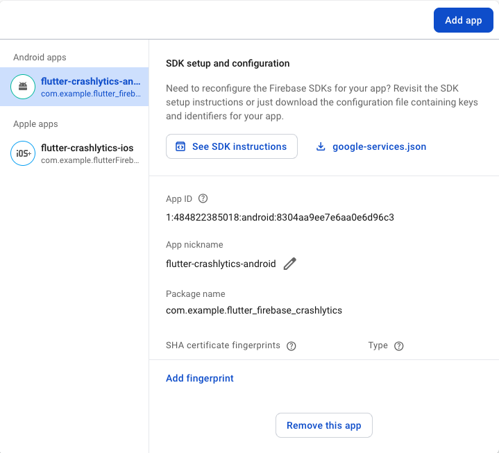
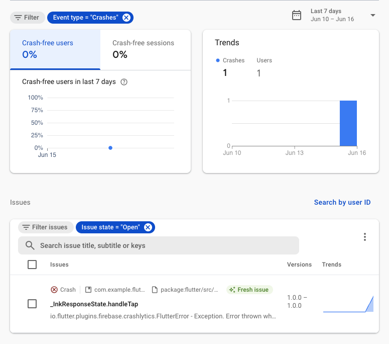
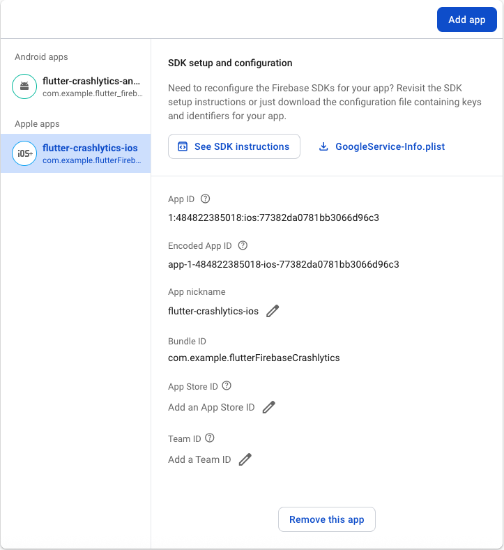
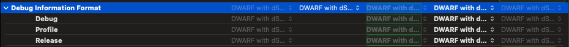
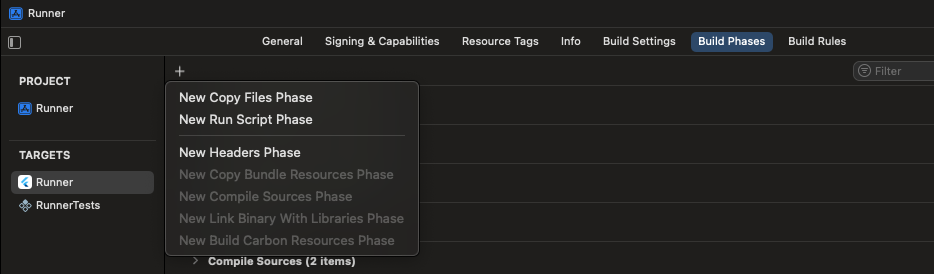
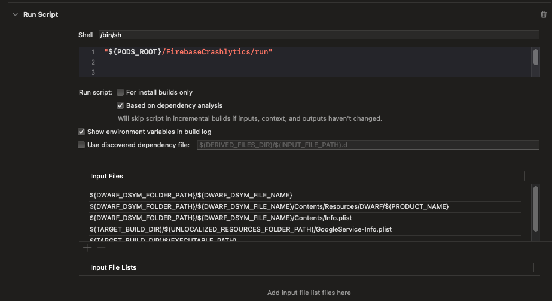

# flutter_firebase_crashlytics

- Add dependencies in pubspec.yaml
```yaml
  firebase_core: ^3.14.0
  firebase_crashlytics: ^4.3.7
```

- In the main function
```dart
WidgetsFlutterBinding.ensureInitialized();
await Firebase.initializeApp();
FlutterError.onError = FirebaseCrashlytics.instance.recordFlutterFatalError;
```

## Setup android
- Add the Android app to your Firebase project


- Add the plugin and dependencies in app/build.gradle.kts
```kotlin
id("com.google.gms.google-services")
```
```kotlin
dependencies {
  implementation(platform("com.google.firebase:firebase-bom:33.15.0"))
  implementation("com.google.firebase:firebase-analytics")
}
```
- Add the plugin in settings.gradle.kts
```kotlin
id("org.jetbrains.kotlin.android") version "2.1.0" apply false
id("com.google.gms.google-services") version "4.4.2" apply false
```
- Crash logs will appear on Firebase


## Setup IOS
- Add the iOS app to your Firebase project
  

- In Build Settings, set Debug Information Format to DWARF with dSYM File
  

- In Build Phases, choose New Run Script Phase
  

- Add the following configuration
  

``` 
"${PODS_ROOT}/FirebaseCrashlytics/run"
```
```
${DWARF_DSYM_FOLDER_PATH}/${DWARF_DSYM_FILE_NAME}
${DWARF_DSYM_FOLDER_PATH}/${DWARF_DSYM_FILE_NAME}/Contents/Resources/DWARF/${PRODUCT_NAME}
${DWARF_DSYM_FOLDER_PATH}/${DWARF_DSYM_FILE_NAME}/Contents/Info.plist
$(TARGET_BUILD_DIR)/$(UNLOCALIZED_RESOURCES_FOLDER_PATH)/GoogleService-Info.plist
$(TARGET_BUILD_DIR)/$(EXECUTABLE_PATH)
```
